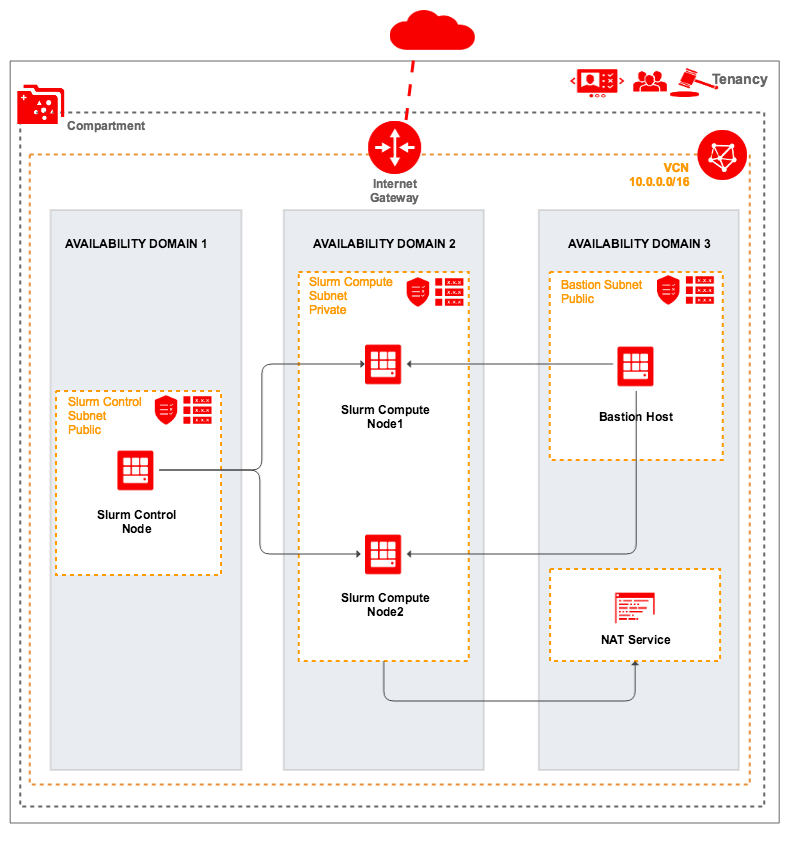

## Create VCN and Deploy Jenkins Cluster
This example creates a VCN in Oracle Cloud Infrastructure including  This configuration generally implements this:


### Using this example
Update terraform.tfvars.template with the required information and change file name to terraform.tfvars.

### Deploy the cluster  
Initialize Terraform:
```
$ terraform init
```
View what Terraform plans do before actually doing it:
```
$ terraform plan
```
Use Terraform to Provision resources and Slurm cluster on OCI:
```
$ terraform apply
```